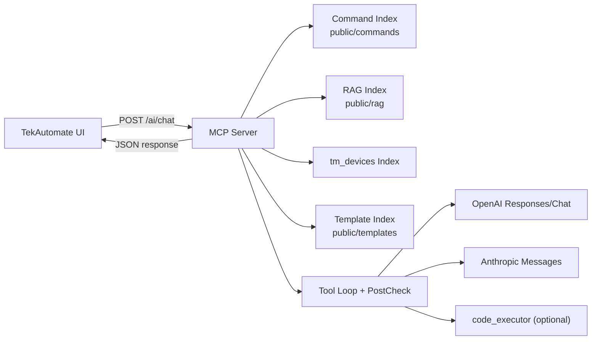
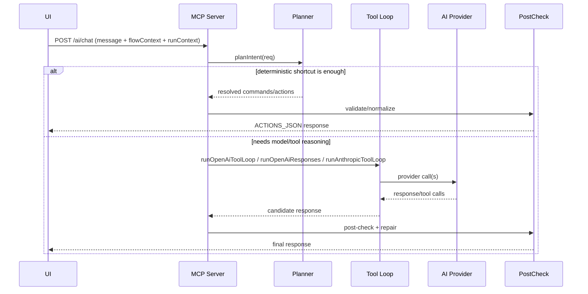

# MCP Server Developer Deep Dive

## Scope

This document explains how the TekAutomate MCP Server works internally, including architecture, request lifecycle, planner/materializer behavior, routing decisions, and API examples.

Primary implementation path: `mcp-server/src`.

## Architecture



## Request lifecycle (`/ai/chat`)



## Core modules

- `src/server.ts`
- HTTP routes, request parsing, CORS, debug endpoints, request logging.
- `src/core/toolLoop.ts`
- Main orchestration and routing decisions.
- `src/core/intentPlanner.ts`
- Deterministic natural-language parse and command resolution.
- `src/core/commandIndex.ts`
- SCPI command loading, normalization, lookup, and ranked search.
- `src/tools/*`
- Retrieval, verification, materialization, validation, instrument-probing tools.
- `src/core/postCheck.ts`
- ACTIONS_JSON safety checks, normalization, and formatting enforcement.

## Routing logic: deterministic vs AI

### Deterministic first

In `mcp_only` mode, the server prioritizes deterministic paths:

- rule-based shortcuts (measurement, FastFrame, common pyvisa patterns)
- planner-based full action synthesis (`planIntent` + `buildActionsFromPlanner`)

If fully resolved, it returns applyable actions without external provider calls.

### AI escalation (`mcp_ai` and normal provider mode)

When deterministic paths are insufficient, server uses provider routes:

- OpenAI hosted Responses/tool loop (preferred for structured build/edit)
- OpenAI chat-completions fallback
- Anthropic messages

For hosted structured requests, server preloads source-of-truth context via tools before/within loop (SCPI groups, batched headers, tm_devices results).

### Reliability fallbacks after model output

- Post-check pass always runs.
- Hybrid planner gap-fill can recover action payload if model output is non-actionable.
- One JSON-only retry occurs when `ACTIONS_JSON` parsing fails.

## Intent planner internals (`src/core/intentPlanner.ts`)

### What planner builds

`PlannerOutput`:

- `intent`: structured request (channels, trigger, measurements, bus, save, recall, status, etc.)
- `resolvedCommands`: verified command candidates
- `unresolved`: unresolved intent fragments
- `conflicts`: resource conflict findings

### Important exported surfaces

- `parseIntent(...)`
- `planIntent(...)`
- `resolveChannelCommands(...)`
- `resolveTriggerCommands(...)`
- `resolveMeasurementCommands(...)`
- `resolveBusCommands(...)`
- `resolveSaveCommands(...)`
- `resolveStatusCommands(...)`
- plus device-family parsers (`parseAfgIntent`, `parseAwgIntent`, `parseSmuIntent`, `parseRsaIntent`)

### Planner purpose

- Maximize deterministic conversion for common tasks.
- Reduce unnecessary model dependency for straightforward build/edit asks.
- Provide structured fallback context when model path is needed.

## Command index and SCPI retrieval

### Data loading

`commandIndex` loads and normalizes multiple command corpora under `public/commands`.

Measured in this workspace:

- normalized entries: about `9307`

### Retrieval modes

- exact header: `getByHeader`
- prefix fallback: `getByHeaderPrefix`
- ranked search: `searchByQuery`
- grouped retrieval: `get_command_group`

### Verification

`verify_scpi_commands` supports strict syntax verification (`requireExactSyntax`) and returns per-command verification status.

## Materializers

### `materialize_scpi_command`

- chooses set/query syntax
- infers placeholder bindings from `concreteHeader`
- applies argument bindings and positional values
- checks unresolved placeholders
- verifies final command using exact source-of-truth check

### `materialize_scpi_commands`

- batch wrapper for multi-command materialization.

### `finalize_scpi_commands`

- convenience "endgame" tool: batch materialize + verified command packaging.

### `materialize_tm_devices_call`

- generates concrete tm_devices Python call from verified `methodPath`.

## Post-check enforcement (`src/core/postCheck.ts`)

Main protections:

- validates action payload schema
- ensures/repairs IDs in replace/insert paths
- enforces query `saveAs`
- deduplicates repeated save variable names
- can auto-group long flat flows
- applies prose length guard (`MCP_POSTCHECK_MAX_PROSE_CHARS`)

## API examples

### 1) `/ai/chat` request (typical steps mode)

```json
{
  "userMessage": "Set edge trigger on CH1 rising at 1.5V and add frequency measurement",
  "outputMode": "steps_json",
  "mode": "mcp_ai",
  "provider": "openai",
  "apiKey": "<user-key>",
  "model": "gpt-5.4-mini",
  "flowContext": {
    "backend": "pyvisa",
    "host": "127.0.0.1",
    "connectionType": "tcpip",
    "modelFamily": "MSO6B",
    "steps": [],
    "selectedStepId": null,
    "executionSource": "steps"
  },
  "runContext": {
    "runStatus": "idle",
    "logTail": "",
    "auditOutput": "",
    "exitCode": null
  }
}
```

### 1) `/ai/chat` response (shape)

```json
{
  "ok": true,
  "text": "...ACTIONS_JSON: {...}",
  "displayText": "...",
  "openaiThreadId": "resp_...",
  "errors": [],
  "warnings": [],
  "metrics": {
    "totalMs": 180,
    "usedShortcut": false,
    "provider": "openai",
    "iterations": 1,
    "toolCalls": 2,
    "toolMs": 15,
    "modelMs": 120
  }
}
```

### 2) `/ai/responses-proxy` request

```json
{
  "model": "gpt-4o",
  "input": [
    { "role": "user", "content": "Summarize this flow" }
  ]
}
```

### 2) `/ai/responses-proxy` behavior

- Uses server key (`OPENAI_SERVER_API_KEY`) for OpenAI call.
- Adds `file_search` tool automatically when `COMMAND_VECTOR_STORE_ID` is configured.
- Streams SSE output through to client.

### 3) `/ai/key-test` request

```json
{
  "provider": "openai",
  "apiKey": "<candidate-key>",
  "model": "gpt-5.4-mini"
}
```

### 3) `/ai/key-test` response (success)

```json
{
  "ok": true,
  "provider": "openai",
  "model": "gpt-5.4-mini",
  "reachable": true,
  "message": "Provider/key/model accepted."
}
```

## Performance notes

Reference benchmark file:

- `mcp-server/reports/level-benchmark-2026-03-18.md`
- report shows 40/40 pass cases in that run.

Local micro-benchmark snapshot (developer test on this workspace):

- `searchByQuery` avg: `~0.54 ms`
- `getByHeader` avg (hot): `~0.009 ms`
- `materialize_scpi_command` avg: `~25.4 ms`
- `finalize_scpi_commands` avg for 3 commands: `~1.8 ms`

Interpretation:

- local indexing and command retrieval are fast
- end-to-end latency is mostly driven by provider/model round-trips when AI path is used

## Practical guidance for contributors

- Use planner/materializer paths whenever request can be deterministic.
- Prefer `finalize_scpi_commands` for multi-command completion in hosted flows.
- Keep post-check strict; it is the last safety gate before apply.
- For new tool additions, ensure source-backed outputs and explicit error/warning behavior.
